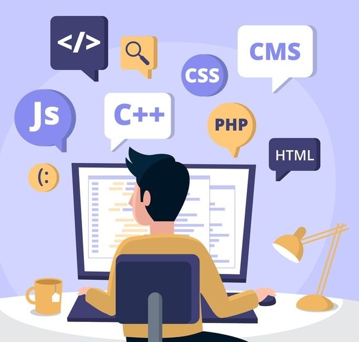

# Hey Everyone, I am Vedansh
<a>Good Better Best   Never Take Rest   Till Good Becomes Better   And Better Becomes Best</a>
 

 
 

# My Git Hub Stats

# Most Common Languages Used

 

# 📋 Programming Languages 

 
 
 

#

# 🤴 Developer/Forums

 
 
 

#

# 📚 Frameworks, Platforms Librariesand IDEs

 
 
 

#

 

# 🎈 Hosting

 
 

#
 

# Open Source

